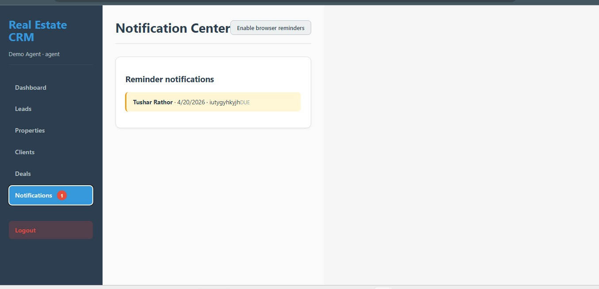
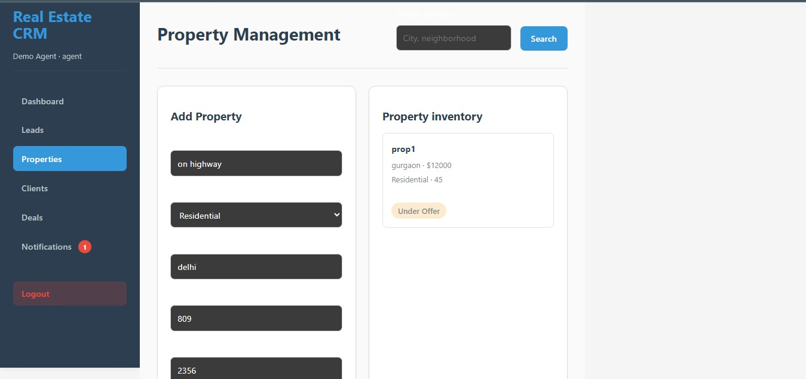
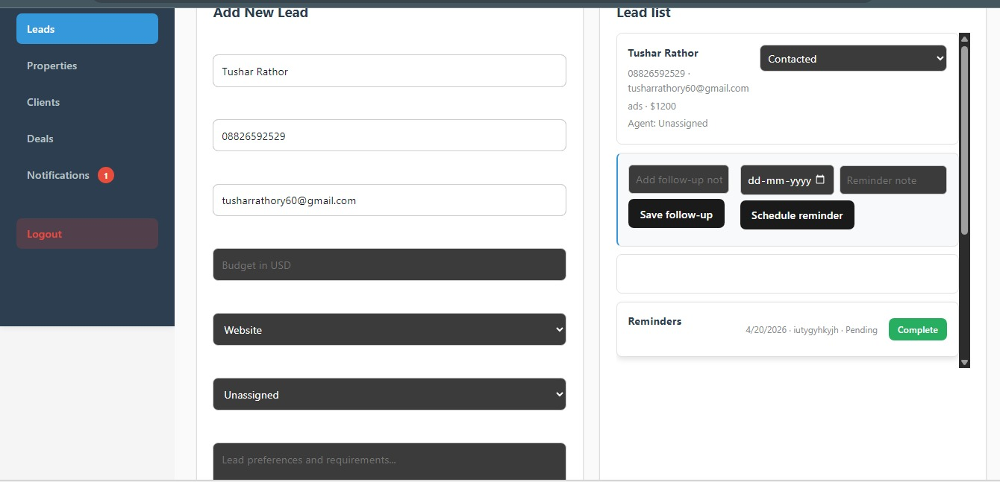
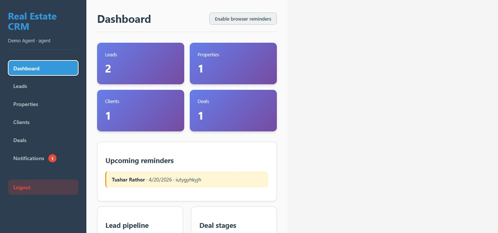
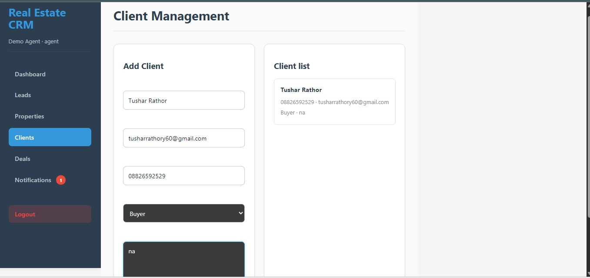
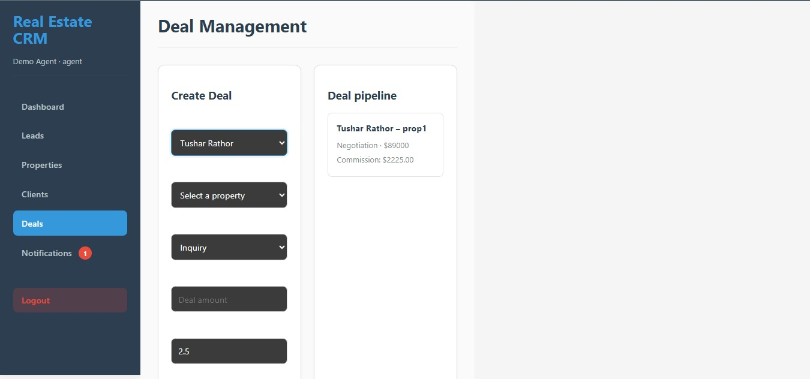
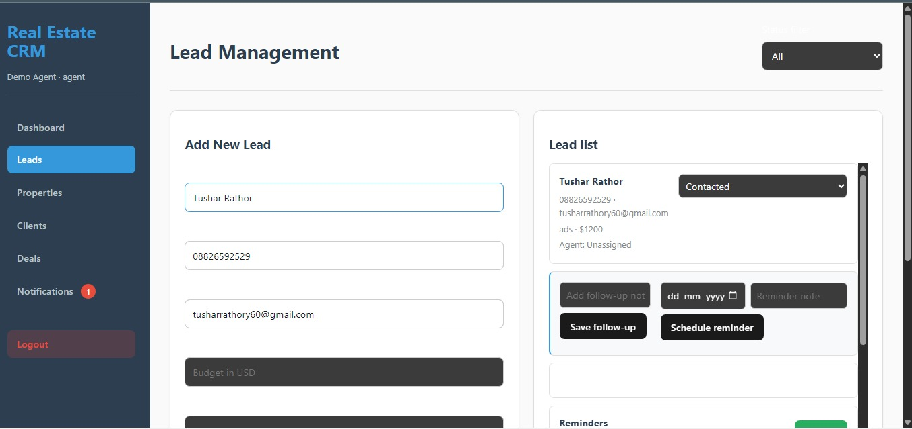

# Real Estate CRM (MERN)

A polished local Real Estate CRM application built with the MERN stack. This repository delivers a CRM experience for real estate professionals, with clean full-stack architecture, lead and property workflows, client management, deal tracking, and insightful reporting.

## 🚀 Live Demo: (https://real-estate-1-jick.onrender.com/)

## Highlights

- Fully functional MERN architecture with separate backend API and frontend UI
- Secure authentication using JWT
- Lead management with status, source, and assignment controls
- Property listing creation with image upload support
- Client profile management and relationship tracking
- Deal pipeline workflows with stage tracking and commissions
- Dashboard analytics for leads, deals, clients, properties, and commissions
- Local-first development with no cloud provider dependency required

demo login details:
username:  demo@realestate.com
password:  demo@1234

## Screenshot Preview

Below are sample application views from the `screenshots/` folder.

## Project Structure

- `backend/` - Express server, MongoDB models, authentication middleware, and REST API routes
- `frontend/` - React + Vite application with responsive UI, forms, and dashboard views
- `screenshots/` - Project screenshots used in this README

## 📡 API Documentation

Frontend: https://real-estate-1-jick.onrender.com/
Backend API: https://real-estate-vdi5.onrender.com/
------------------------------------------------------------------------

### 🔐 Auth

POST /auth/register\
POST /auth/login\
GET /auth/users\
POST /auth/preferences/email-notifications

------------------------------------------------------------------------

### 📊 Leads

GET /leads\
POST /leads\
POST /leads/:id/status\
POST /leads/:id/follow-up\
POST /leads/:id/reminder\
POST /leads/:id/reminder/:reminderId/complete\
GET /leads/reminders/notifications

------------------------------------------------------------------------

### 🏠 Properties

GET /properties\
POST /properties

------------------------------------------------------------------------

### 👤 Clients

GET /clients\
POST /clients

------------------------------------------------------------------------

### 💰 Deals

GET /deals\
POST /deals

------------------------------------------------------------------------

### 📈 Reports

GET /reports/summary

------------------------------------------------------------------------

## Local Development

### Backend Setup

1. Open a terminal and navigate to `backend`
2. Run `npm install`
3. Copy `.env.example` to `.env` and update any required environment variables
4. Start the backend server with `npm run dev`

### Frontend Setup

1. Open a terminal and navigate to `frontend`
2. Run `npm install`
3. Start the frontend development server with `npm run dev`
4. Open the browser at `http://localhost:5173`

## Recommended Workflow

1. Start the backend first from `backend/`
2. Start the frontend from `frontend/`
3. Use the UI to log in, create leads, add properties, register clients, and manage deals
4. Review dashboard analytics for a quick summary of key metrics

## Notes

- This app is designed for local evaluation and interviewer demos.
- The codebase is ready for enhancements such as email notifications, map integration, export reports, and mobile-friendly UX.
- Screenshots are included in the `screenshots/` folder for reference and presentation.
